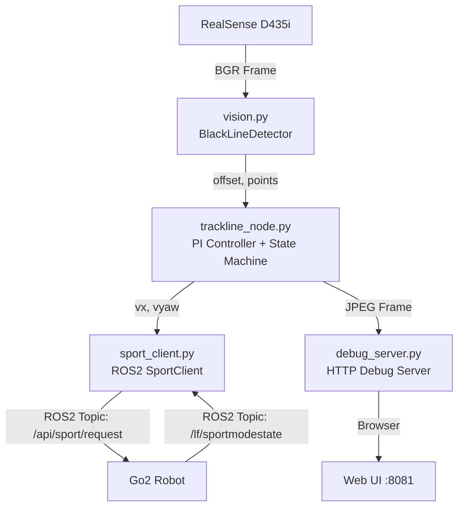

# 🐕 Go2 黑线巡线系统

[](LICENSE)
[](https://docs.ros.org/)
[](https://www.python.org/)

基于 Unitree Go2 机器狗和 Intel RealSense D435i 深度相机的**黑线巡线系统**。提供 **SDK2 直连** 和 **ROS2 原生** 两种控制方案，支持 PI 自适应控制、浏览器实时调试。

<p align="center">
  
  
  
</p>

---

## 📑 目录

- [版本对比](#-版本对比)
- [功能特性](#-功能特性)
- [硬件要求](#-硬件要求)
- [快速开始 (SDK2 版)](#-快速开始-sdk2-版)
- [快速开始 (ROS2 版)](#-快速开始-ros2-版)
- [参数说明](#-参数说明)
- [网络配置](#-网络配置)
- [调试页面](#-调试页面)
- [项目结构](#-项目结构)
- [常见问题](#-常见问题)

---

## 🔀 版本对比

本项目提供**两种实现方案**，按需选用：

| 维度 | SDK2 直连版 | ROS2 原生版 |
|------|------------|------------|
| **入口** | `trackline.py` | `trackline_ros2/` |
| **通信** | Unitree SDK2 Python 绑定 (DDS) | ROS2 topic `unitree_api::Request` (CycloneDDS) |
| **依赖** | `unitree_sdk2_python` | ROS2 Humble/Foxy + `unitree_go` / `unitree_api` |
| **启动** | `python3 trackline.py` | `ros2 launch unitree_trackline trackline.launch.py` |
| **参数调优** | 命令行参数 (启动时固定) | `ros2 param set` 动态调整 |
| **ROS2 工具链** | 不兼容 | ✅ rviz2 / rosbag / ros2 topic |
| **多节点协作** | 单进程 | ✅ ROS2 节点图 |
| **上手难度** | ⭐ 简单 | ⭐⭐ 需 ROS2 基础 |
| **适用场景** | 快速验证、单机调试 | 生产部署、多传感器融合 |

> 💡 **建议**：新手或快速测试用 SDK2 版；需要与 SLAM、导航栈等 ROS2 模块集成时用 ROS2 版。

---

## ✨ 功能特性

- 🎯 **实时黑线检测** — OpenCV 多扫描线 + 三次多项式曲线拟合
- 🎛️ **PI 自适应控制** — P(比例) + I(积分) 控制器，速度平滑滤波
- 🛑 **智能丢线处理** — 短暂丢线直走 → 较长丢线减速 → 彻底丢线停止
- 🌐 **Web 调试面板** — 浏览器实时画面 + 运动命令按钮 (stand/damp/stop)
- 🔄 **自动重连** — SDK2 连接断开自动恢复
- ⚡ **动态调参** — ROS2 版支持运行时 `ros2 param set` 无重启调参
- 📸 **截图保存** — 按 `S` 键随时保存检测画面

---

## 🔧 硬件要求

| 设备 | 说明 |
|------|------|
| **Unitree Go2** | 机器狗，固件支持 DDS 通信 |
| **Intel RealSense D435i** | 深度相机，USB 3.0 连接 |
| **网线** | 连接电脑与 Go2 的有线网络 |
| **Ubuntu 20.04/22.04** | 运行环境 |

---

## 🚀 快速开始 (SDK2 版)

### 1. 安装依赖

```bash
cd trackline
bash setup_env.sh
```

脚本自动安装：`opencv-python`, `numpy`, `pyrealsense2`, `unitree_sdk2_python`

### 2. 连接 Go2

网线连接电脑与 Go2，设置电脑 IP 为 `192.168.123.99/24`。

### 3. 启动巡线

```bash
# 完整巡线 (默认参数)
python3 trackline.py

# 仅调试画面，不控制机器人
python3 trackline.py --no-motion

# 自定义参数
python3 trackline.py --speed 0.3 --kp 0.008 --threshold 70

# 指定网口
python3 trackline.py --interface eth0
```

### 4. 查看调试画面

浏览器打开 `http://127.0.0.1:8081`

---

## 🚀 快速开始 (ROS2 版)

### 1. 安装 Unitree ROS2 工作空间

```bash
# 克隆 unitree_ros2 (如果还没有)
cd ~
git clone https://github.com/unitreerobotics/unitree_ros2

# 安装 ROS2 依赖
sudo apt install ros-$ROS_DISTRO-rmw-cyclonedds-cpp
sudo apt install ros-$ROS_DISTRO-rosidl-generator-dds-idl
sudo apt install libyaml-cpp-dev

# 编译 cyclonedds_ws
cd ~/unitree_ros2/cyclonedds_ws
source /opt/ros/$ROS_DISTRO/setup.bash
colcon build
```

### 2. 集成 trackline_ros2 包

```bash
# 将 trackline_ros2 链接到 example workspace
ln -s /path/to/trackline/trackline_ros2 ~/unitree_ros2/example/src/trackline_ros2

# 编译
cd ~/unitree_ros2/example
source ~/unitree_ros2/cyclonedds_ws/install/setup.bash
colcon build
```

### 3. 配置环境

```bash
source ~/unitree_ros2/setup.sh        # 自动检测网口
# source ~/unitree_ros2/setup.sh eth0  # 指定网口
```

### 4. 启动巡线

```bash
# launch 方式 (推荐)
ros2 launch unitree_trackline trackline.launch.py

# 节点方式
ros2 run unitree_trackline trackline_node

# 带自定义参数
ros2 launch unitree_trackline trackline.launch.py speed:=0.3 kp:=0.008

# 仅调试模式
ros2 launch unitree_trackline trackline.launch.py enable_motion:=false
```

### 5. 运行时动态调整参数

```bash
ros2 param set /trackline_node speed 0.4
ros2 param set /trackline_node kp 0.008
ros2 param set /trackline_node gray_threshold 70
ros2 param list  # 查看所有可调参数
```

---

## 📊 参数说明

### 运动控制

| 参数 | 默认值 | CLI (SDK2) | ROS2 Param | 说明 |
|------|--------|-----------|------------|------|
| 线速度 | 0.3 m/s | `--speed` | `speed` | 前进速度，建议 0.2–0.5 |
| P 系数 | 0.005 | `--kp` | `kp` | 比例控制，越大转向越激进 |
| I 系数 | 0.0001 | `--ki` | `ki` | 积分控制，消除稳态误差 |
| 最大角速度 | 0.5 rad/s | `--max-angular` | `max_angular` | 转向限幅保护 |
| 减速比例 | 0.5 | `--low-speed` | `low_speed_ratio` | 丢线减速时的速度比例 |

### 丢线处理

| 参数 | 默认值 | CLI (SDK2) | ROS2 Param | 说明 |
|------|--------|-----------|------------|------|
| 丢线阈值 | 30 帧 | `--lost-threshold` | `lost_threshold` | 连续丢线多少帧后减速 |
| 检测阈值 | 2 点 | — | `detect_threshold` | 最少有效检测点数 |

### 视觉检测

| 参数 | 默认值 | CLI (SDK2) | ROS2 Param | 说明 |
|------|--------|-----------|------------|------|
| 灰度阈值 | 80 | `--threshold` | `gray_threshold` | 黑线灰度 (0–255)，越低越敏感 |
| 扫描线数 | 20 | — | `scan_lines` | 影响检测密度 |
| 最小线宽 | 8 px | — | `min_width` | 过滤噪点 |

### 调试

| 参数 | 默认值 | CLI (SDK2) | ROS2 Param | 说明 |
|------|--------|-----------|------------|------|
| HTTP 端口 | 8081 | `--port` | `http_port` | Web 调试页面端口 |
| 启用运动 | true | `--no-motion` | `enable_motion` | 是否控制机器人 |
| 启用 HTTP | true | `--no-http` | `enable_http` | 是否启动调试服务器 |

---

## 🌐 网络配置

Go2 默认通信 IP 为 `192.168.123.161`，电脑需配置同网段静态 IP：

```bash
# 方式一：命令行 (临时)
sudo ip addr add 192.168.123.99/24 dev eth0

# 方式二：图形界面
# Settings → Network → Wired → IPv4 → Manual
# Address: 192.168.123.99  Netmask: 255.255.255.0

# 验证连通
ping 192.168.123.161
```

---

## 🖥️ 调试页面

程序启动后，浏览器访问 `http://127.0.0.1:8081`：

- 📷 **实时检测画面** — 黑线拟合曲线 + 偏移量指示
- 📊 **状态信息** — 当前模式、速度指令、检测点数、连接状态
- 🎮 **运动控制按钮** — 起立/趴下/平衡站立/阻尼/停止 (ROS2 版)

---

## 📁 项目结构

```
trackline/
├── README.md                       # 项目总览 (本文件)
├── setup_env.sh                    # SDK2 版一键安装脚本
├── trackline.py                    # SDK2 直连版主程序
│
└── trackline_ros2/                 # ROS2 原生版 (ROS2 Package)
    ├── README.md                   # ROS2 版详细文档
    ├── package.xml                 # ROS2 包元数据
    ├── setup.py                    # Python 安装
    ├── setup.cfg
    ├── resource/
    │   └── unitree_trackline       # ament 索引
    ├── launch/
    │   └── trackline.launch.py     # ROS2 Launch 文件
    ├── config/
    │   └── trackline_params.yaml   # 默认参数 YAML
    └── unitree_trackline/
        ├── __init__.py
        ├── trackline_node.py       # ROS2 巡线主节点
        ├── vision.py               # 黑线视觉检测 (BlackLineDetector)
        ├── sport_client.py         # Go2 ROS2 运动客户端 (SportClient)
        └── debug_server.py         # HTTP 调试服务器 (DebugHTTPServer)
```

### 模块依赖关系



---

## ❓ 常见问题

<details>
<summary><b>RealSense D435i 未检测到</b></summary>

```bash
lsusb | grep Intel
rs-enumerate-devices
sudo apt install --reinstall librealsense2-dkms librealsense2-utils
```
</details>

<details>
<summary><b>SDK2 / ROS2 连接不上 Go2</b></summary>

```bash
# 检查物理连接 (网线/网口指示灯)
ip addr show eth0          # 应为 192.168.123.99
ping 192.168.123.161       # Go2 默认 IP
sudo ufw status            # 检查防火墙
ros2 topic list | grep sport  # ROS2 版验证话题
```
</details>

<details>
<summary><b>黑线检测不稳定</b></summary>

- 调整灰度阈值：光线暗时降低，光线亮时提高
- 确保黑线与地面有足够对比度
- 调整相机角度使黑线在画面下方 3/4 区域内
- 增加 `scan_lines` 提高检测密度
</details>

<details>
<summary><b>机器人转向过度/不足</b></summary>

- 增大 `kp` → 转向更激进 | 减小 `kp` → 转向更柔和
- 增大 `ki` → 更好地纠正稳态偏移
- 限制 `max_angular` 防止急转
</details>

<details>
<summary><b>相机权限问题</b></summary>

```bash
sudo usermod -aG video $USER
# 重新登录后生效
```
</details>

---

## 🙏 致谢

- [Unitree Robotics](https://github.com/unitreerobotics) — Go2 SDK2 & ROS2 支持
- [Intel RealSense](https://github.com/IntelRealSense/librealsense) — D435i 相机驱动
- [OpenCV](https://opencv.org/) — 计算机视觉库

## 📄 License

MIT License
